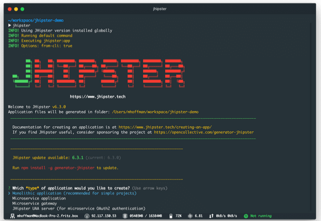

# Learning Jhipster

## What is Jhipster

- `JHipster` is a development platform to generate, develop and deploy `Spring Boot + Angular / React / Vue` Web applications and Spring microservices.

- Basically, it is a Yeoman generator which creates applications that include `Spring Boot, Bootstrap and Angular or React or Vue`.

## Why Jhiptser

- is open source
- supports `React`, `Vue`, `Angular` for the frontend
- uses `TypeScript` for each frontend framework
- uses `Spring Boot 2.1` so we can develop our application in `Java 11+`
- provides out-of-the-box user management including email verification and password reset
- can be easily deployed to `CloudFoundry`, `Heroku`, `OpenShift` or `AWS`
- provides a robust microservice architecture using `Netflix OSS`, `Elastic Stack`, and `Docker`
- uses powerful tools `Yeoman`, `Webpack` and `Maven/Gradle`
- has a good test coverage for entities on frontend and backend side

## Quick start

### Install Prerequisites

- Make sure to install `Java`, `Git` and `Node.js` which are prerequisites for JHipster. - Java Install - https://www.oracle.com/java/technologies/javase-downloads.html   - Git Install - https://git-scm.com   - Node.js Install - http://nodejs.org  

- install JHipster as global npm package: `npm install -g generator-jhipster`

- create a new project directory and cd into it `mkdir learning-Jhipster && cd learning-Jhipster`

- run `jhipster` which starts the generator

  

- We need to amswer appox. 16 questions to create our application using `Jhipster`.

- 1. `The first question JHipster will ask you is what kind of application you want to generate.` with around four options.
- `Ans` A “monolithic” architecture uses a single, one-size-fits-all application, which contains both the front-end AngularJS code, and the back-end Spring Boot code. A “microservices” architecture splits the front-end and the back-end, so that it’s easier for your application to scale and survive infrastructure issues.

- 2. ``
